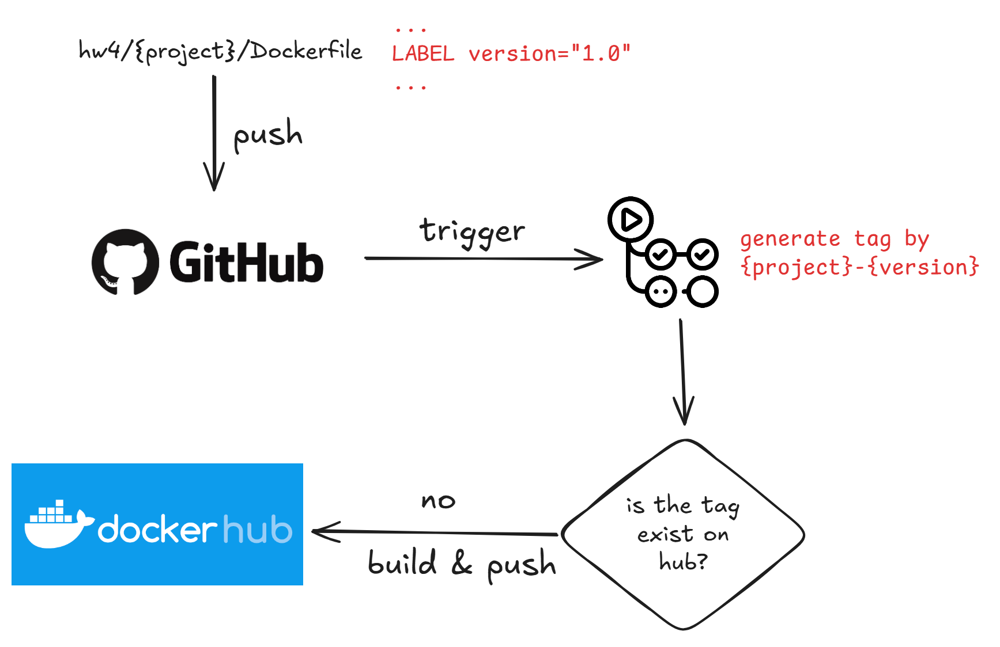

# Homework 4
There's two example docker image: mitmproxy, nextjs

## Nextjs Example App
```
cd hw4/nextjs
docker build -t nextjs-example-app .
docker run -p 3000:3000 nextjs-example-app
```


## Mitmproxy Example App
```
cd hw4/mitmproxy
docker build -t mitmproxy-example .
docker run --rm -it --net=host --cap-add=NET_ADMIN mitmproxy-example
```

# Workflow


1. some changes been push to repo
2. trigger Actions if the change is make under `hw4/**`
3. Actions extract version from Dockerfile and combine it with the project folder name
4. Actions check if the tag already exist on hub, if yes then exit
5. Actions build and push the image to hub